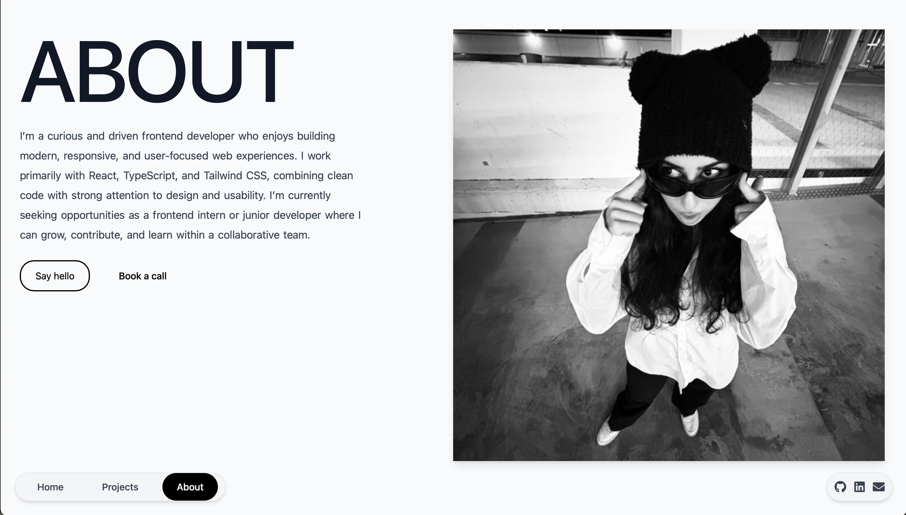

# Original Portfolio

A **personal web portfolio** showcasing my front-end projects, interactive UI components, and modern design experiments. Built entirely by me, this project highlights my expertise in **React, TypeScript, Vite, and Tailwind CSS**, along with responsive design, animations, and component-based architecture.

This portfolio demonstrates my **professional front-end development skills**, attention to detail in **UI/UX**, and ability to create **interactive, maintainable, and responsive web applications**.

---

## 📸 Portfolio Screenshots

**Hero Section / Landing Page**  
  

**About Section / Portfolio Overview**  
  

---

## 🛠️ Technologies Used

- **React + TypeScript** – component-driven, type-safe architecture for maintainable code  
- **Vite** – fast development server and optimized builds  
- **TailwindCSS** – utility-first styling for responsive design and maintainable classes  
- **Framer Motion** – smooth animations for text, paragraphs, and interactive transitions  
- **SwiperJS** – dynamic project image sliders with autoplay and looping  
- **Responsive Design** – mobile-first (tested on mobile; tablet adjustments per component)  
- **Reusable Components** – buttons, project cards, hero section, animated text  

---

## 🔹 Key Features

### Hero Section
- Large animated title using `AnimatedText` component  
- Project image slider (Swiper) on left, description on right  
- Smooth animations triggered when elements scroll into view  
- Mobile-first adjustments for font sizes, spacing, whitespace, letter spacing  

### Interactive Components
- Buttons created with reusable `Button` component  
- Project cards designed for desktop and mobile  
- Hover and scroll animations preserved across breakpoints  

### Responsive Layout
- Flexbox and Tailwind utilities manage multi-column layouts  
- Mobile adjustments done at component level, desktop layout preserved  
- Careful spacing for readability, including paragraph width control (`max-w-[36ch]`)  

### Performance & Accessibility
- Images lazy-loaded via `loading="lazy"`  
- Semantic HTML (`section`, `h1`, `p`) and ARIA-friendly structure  
- Optimized for fast load times with Vite and lightweight Tailwind CSS  

### Architecture & Maintainability
- Component-driven structure: Hero, Buttons, AnimatedText, Project Cards are reusable  
- Responsive adjustments primarily handled within each component  
- Page-level overrides only for context-specific layout tweaks  
- Clean code principles: minimal overrides, clear classnames, semantic structure, modular design  

### Design & UX Principles
- Clean, minimalistic aesthetic emphasizing content and projects  
- Generous whitespace to guide user focus  
- Interactive elements and micro-animations enhance engagement without overwhelming  
- Mobile-first approach ensures usability on small screens while retaining desktop fidelity  

---

## 🎯 My Role

- Designed and implemented the **entire front-end architecture**  
- Built **reusable components** for projects, buttons, animations, and layout  
- Integrated **interactive UI elements** like sliders and hover/scroll animations  
- Ensured **responsive design and readability** on mobile devices  
- Managed **project structure, TypeScript types, and build workflow**  

---

## 🔗 Live Demo

Check out the live portfolio: [https://original-portfolio-swart.vercel.app](https://original-portfolio-swart.vercel.app)

